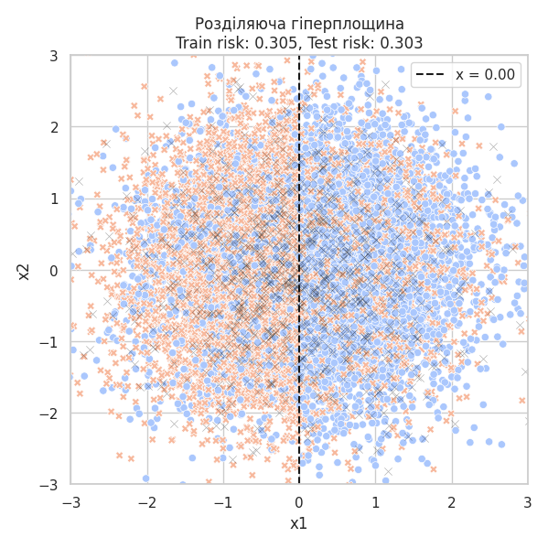
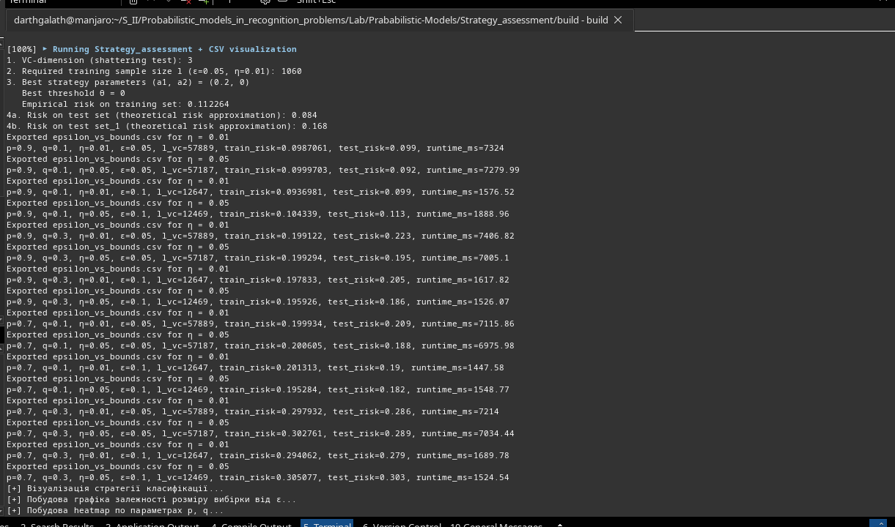

# Prababilistic-Models
Labs on "Probabilistic models in pattern recognition problems" course.

# Лабораторна робота

## Завдання:

1. Обчислити розмірність Вапніка-Червоненкіса (VC-dimension) множини стратегій.
2. Оцінити мінімальний розмір навчальної вибірки `l`, необхідний для гарантії оцінки емпіричного ризику з похибкою ε та довірчою ймовірністю 1-η.
3. Для різних значень параметрів `p`, `q`, ε, η, N:

   * згенерувати навчальну вибірку;
   * знайти стратегію з мінімальним емпіричним ризиком;
   * протестувати знайдену стратегію на новій тестовій вибірці;
   * побудувати графіки межі розділення та графіки зростання розміру вибірки `l` від ε.

---

## Теоретична модель

Точка $x = (x_1, x_2) \in \mathbb{R}^2$ генерується зі стандартного нормального розподілу:

$$
\mathcal{N}(0, I) = \mathcal{N}\left(
\begin{bmatrix} 0 \\ 0 \end{bmatrix},
\begin{bmatrix} 1 & 0  \\ 0 & 1 \end{bmatrix}
\right)
$$

Мітка присвоюється за правилом:

* якщо $x_1 \geq 0$: з імовірністю `p` — мітка `0` (білий), з імовірністю `1-p` — мітка `1` (чорний);
* якщо $x_1 < 0$: з імовірністю `q` — мітка `0`, з імовірністю `1-q` — мітка `1`.

Допустимі стратегії класифікації:

$$
q(x) = \left\{ case
0, & (x, a) \geq \theta \\
1, & (x, a) < \theta 
$$
---

## 1. Обчислення VC-розмірності

Функція `compute_vc_dimension()` намагається "розбити" $n \in \{1, 2, 3, 4\}$ точок усіма можливими мітками ($2^n$ розфарбувань).
Для кожного випадку перевіряється, чи можна розділити точки гіперплощиною (лінією).

**Результат:**
Для класифікаторів у вигляді ліній у $\mathbb{R}^2$:
$VC(F) = 3$

---

## 2. Обчислення розміру навчальної вибірки

### Спрощене наближення:

$$
l \ge \frac{1}{2\varepsilon^2} \ln\left(\frac{2}{\eta}\right)
$$

(Функція: `compute_simplified_sample_size()`)

### Точна VC-оцінка (рішенням нерівності):

$$
l \ge \frac{1}{\varepsilon^2}\left[4d \ln\left(\frac{2el}{d}\right) + \ln\left(\frac{4}{\eta}\right)\right]
$$

(Функція: `compute_vc_sample_size()` — використовується двійковий пошук)

---

## 3. Генерація вибірки та стратегія

### Генерація точок:

```cpp
vector<Point> generate_dataset(int l, double p, double q, mt19937& gen);
```

### Пошук найкращої стратегії:

Повний перебір $a \in [-1, 1]^2, \theta \in [-2, 2]$ з кроком 0.2. Вибирається стратегія з найменшим емпіричним ризиком:

```cpp
void find_best_strategy(...);
```

---

## 4. Проведення експерименту

```cpp
void run_experiment(...);
```

Для кожної конфігурації `p, q, ε, η`:

* генерується навчальна вибірка $l$ точок (відповідно до VC-оцінки);
* знаходиться найкраща стратегія $(a, \theta)$;
* тестується на нових `N = 1000` точках;
* результати зберігаються у:

  * `*_train.csv` — навчальна вибірка
  * `*_test.csv` — тестова вибірка
  * `*_params.csv` — знайдені параметри стратегії
  * `experiment_summary.csv` — мета-інформація про всі запуски

---

## 5. Побудова графіків

### CSV-файли:

* `epsilon_vs_bounds.csv` — зіставлення між `ε` та розмірами `l` (VC та спрощений);
* `experiment_summary.csv` — результати для всіх `p, q, ε, η` конфігурацій;

### Python-візуалізація (`csv_plotting.py`):

* побудова межі розділення

* вивід емпіричних ризиків


* побудова залежності `l(ε)`


---

## Висновки

* Клас гіперплощин у $\mathbb{R}^2$ має VC-розмірність 3.
* Для заданої точності $\varepsilon = 0.05$ і довіри $\eta = 0.01$, кількість прикладів перевищує 37000 (відповідно до теоретичної межі).
* Емпіричний ризик та тестовий ризик обчислюються для кожної стратегії, результати можна візуалізувати й аналізувати.
* Програма дозволяє проводити серію експериментів і будувати теоретично обґрунтовані оцінки для ймовірнісного навчання.

---

## Автоматизовані результати

* Усі результати збережено у CSV для подальшого аналізу та побудови графіків.
* Візуалізація чітко показує межу класифікації та емпіричні ризики для кожного випадку.

---

**Автор:** Студент групи ФІ-42мн Дмитро Голубцов
**Файли:** `main.cpp`(обчислення), `csv_plotting.py`(візуалізація результатів), `*.csv`, `*.png`, `README.md`

---
